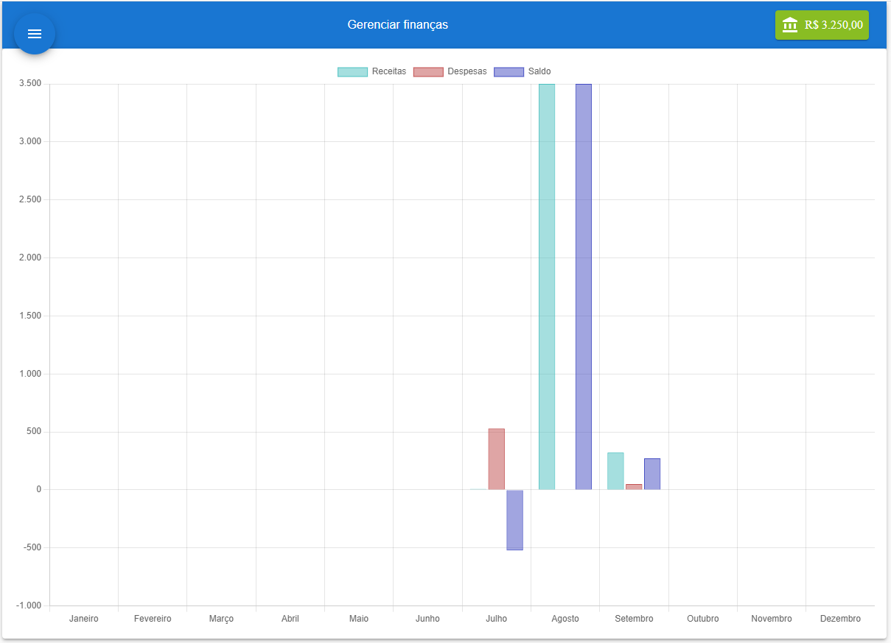

# Financial Manager



## About the project

A simple financial manager to control your finances, specifically revenues and expenses. The system has categories for both expenses and revenues, and it is also possible to repeat the value for the following months. The system has charts that display data by categories, monthly revenues and expenses, and more. The system uses localStorage for data storage but can be implemented to work with an API. Despite using localStorage, the system has a complete CRUD functionality.

## Technical information

Although it is a simple project, it uses common tools in everyday development, such as Material UI, Redux, react-router-dom, framer-motion, Vite, TypeScript, among others. The system includes various techniques and functionalities that can be used in other projects.


## Used Tools

- ReactJs com typescript
- Vite
- Node v18.12.0
- Material UI v5.14.1
- Framer motion
- Redux com redux toolkit
- Styled components
- Chart.js
- React router dom v6.14.1


## How to use

```sh
Clone the project:

$git clone git@github.com:gleisoncoruja/personal-finance-management.git

Install yarn if you don't have it yet:

$npm install -g yarn

Install the dependencies:

$yarn

Once the dependencies are installed, you can run the project:

$yarn dev

```
